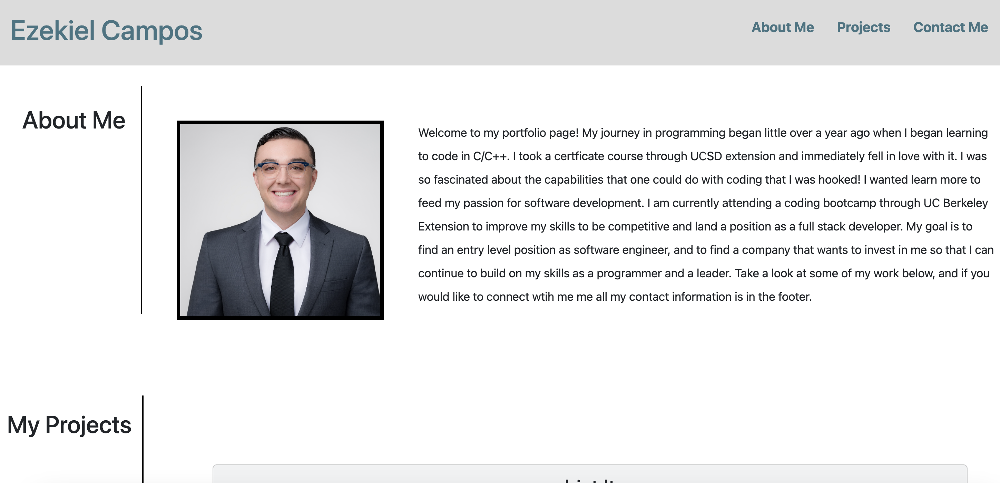

# Challenge 2 UC Berkeley Extension Building A Professional Portfolio

## Description

For this project I continued to build on top of html and css to create a professional portfolio webpage. I utilized flexboxes and media queries to outline my portfolio page.  In addition to that pseudo classes and elements helped emphasize certain sections and wording. Using the browser helped me visually understand how my page was rendering and what adjustments I need to make to get the result I wanted. During the coding process my vision for the portfolio was constantly changing.  This assignment challenged me to be apprach problems from different angles and to be flexible when things do not work the way I wanted them too.  As the course progresses and my skills as a programmer advance I will continue improving and adding on to this repo.  
## Installation

No installations used (NPM)

## Usage

This webpage will be used to showcase my skills and talents as a programmer through my projects to potential future employers.

### Link
https://ezekielcampos.github.io/ezekiel-campos-professional-portfolio/#contact

### Screenshot

